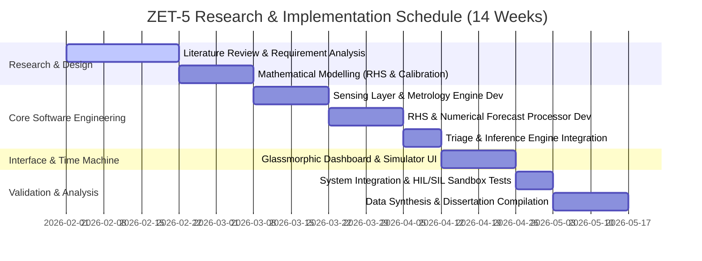

# CHAPTER 1: INTRODUCTION

## 1.1 Background of the Study
Electricity supply instability in Zimbabwe represents a persistent and structural challenge for residential consumers. The Zimbabwe Electricity Supply Authority (ZESA) Holdings and its transmission subsidiary, the Zimbabwe Electricity Transmission and Distribution Company (ZETDC), have routinely implemented daily load shedding schedules ranging from 10 to 19 hours since 2019. This deficit is driven by hydrological constraints at the Kariba Hydroelectric Power Station, frequent equipment failures at the ageing Hwange thermal power plant, and structural transmission losses across the national grid. 

To cope with this supply crisis, Zimbabwean households have pivoted toward two main strategies: purchasing solar photovoltaic (PV) hybrid systems and managing prepaid ZESA token utility meters. The introduction of prepaid token meters was designed to eliminate utility debt and enforce fiscal discipline. However, it introduced a new operational paradigm for domestic energy management: **a finite, rapidly depleting energy budget**.

Prepaid tokens are purchased in kilowatt-hours (kWh) and continuously decline as household loads operate. While consumers purchase energy as a discrete budget, standard domestic electrical distribution boards (DBs) act as entirely passive interfaces. A typical domestic DB consists of miniature circuit breakers (MCBs) and earth leakage protection devices. These components are designed exclusively to trip during extreme overcurrent faults or ground leakage events. They possess no budget awareness, no load prioritisation capacity, and no forecasting capabilities. 

Consequently, when a prepaid token balance depletes to zero, the utility meter abruptly disconnects all electrical supply to the residence. This binary, all-or-nothing cutoff treats all household loads equally. The refrigerator—which houses perishable foodstuffs—loses power at the exact same millisecond as non-essential convenience loads, such as geysers, air conditioners, or entertainment consoles. This systemic inability to prioritize loads based on the remaining energy runway leads to premature food spoilage, accelerated backup battery depletion, and high domestic utility anxiety.

This research addresses this structural gap by designing, implementing, and validating **ZET-5 (Zimbabwean Energy Tracker - 5 Monitored Channels)**. Moving beyond passive protection, ZET-5 is architected as a **High-Fidelity Software-in-the-Loop (SIL) Simulated Metrology and Predictive Forecasting Prototype**. The system models five disaggregated residential circuit loops (e.g., Geyser, Fridge, Borehole Pump, Entertainment, and Lights) and utilizes **online machine learning** to establish cyclic daily load signatures. By doing so, ZET-5 runs **iterative numerical integrations** to forecast the exact prepaid depletion date and hour, executing graduated demand-side response actions to stretch the remaining energy runway.

---

## 1.2 Problem Statement
The domestic electrical infrastructure in Zimbabwe is fundamentally passive and uncoordinated. Traditional ZESA prepaid meters and standard distribution boards operate in a functional silo, presenting three primary failure modes:

1. **Passive all-or-nothing cutoff:** Prepaid meters disconnect the entire home immediately upon budget depletion. Because there is no integration between the billing meter and the distribution board, the system cannot perform a graduated shutdown. A household that could have preserved essential power for two additional days by shedding heavy convenience loads (like the geyser or borehole pump) instead experiences a complete, immediate blackout.
2. **Mathematical invalidity of static forecasting:** Existing residential energy calculators rely on simple linear division (e.g., $\text{Token Balance} / \text{Current Wattage}$) to project remaining runway. This calculation is highly inaccurate. Domestic electrical loads are deeply cyclic, marked by steep morning and evening peaks (geysers, cooking) and prolonged nighttime troughs. Static division overestimates runway during low-use periods and severely underestimates depletion risk during peak periods, rendering it useless for practical budgeting.
3. **Metrology mismatch and cumulative integration drift:** Standard low-cost current sensing systems measure RMS current and calculate apparent power ($S = V \cdot I$ in Volt-Amps). However, utility meters bill consumers strictly on **Real Power** ($P = V \cdot I \cdot \cos\phi$ in Watts) while being subjected to voltage fluctuations and sensor calibration drift. Without active Power Factor (PF) correction and a closed-loop calibration feedback mechanism, custom monitoring engines accumulate significant integration drift, quickly losing synchronisation with the utility's physical meter.

There is a clear engineering requirement for a system that can disaggregate household load profiles, dynamically correct for power factor and metrology drift, construct an adaptive behavioral consumption model, and project remaining energy runway using iterative numerical integrations. To be accessible in developing economic contexts, this system must operate entirely at the edge without cloud dependencies, internet requirements, or expensive hardware configurations.

---

## 1.3 Research Aim and Objectives

### 1.3.1 Research Aim
To design, implement, and validate a High-Fidelity Software-in-the-Loop (SIL) Simulated Metrology and Predictive Energy Forecasting Prototype (ZET-5) that dynamically profiles residential consumption, mitigates metrology drift, and performs tier-based autonomous load triage to maximize the operational runway of a finite prepaid energy token.

### 1.3.2 Research Objectives
1. To engineer a high-fidelity disaggregated metrology engine that models five domestic circuit loops, incorporating appliance-specific **Power Factor (PF) correction** to reflect real utility billing.
2. To design a closed-loop **Meter Sync Calibration Engine** that utilizes manual synchronization inputs to calculate and eliminate cumulative integration drift over time.
3. To develop a **Rolling Hourly Signature (RHS) online learning algorithm** that builds a 24-bin cyclic load fingerprint of household habits using real-time exponential moving averages (EMA).
4. To implement a predictive forecasting processor that performs **iterative numerical integrations** over the RHS matrix to project the exact date and hour of token depletion.
5. To construct an autonomous **Inference and Triage Engine** that executes graduated demand-side response actions (load shedding) based on target budget runways.
6. To validate the system's operational accuracy and self-learning adaptation using an interactive **Virtual Time Machine Sandbox** served via a local glassmorphic dashboard interface.

---

## 1.4 Significance of the Study
This study contributes to the field of edge computing, smart grid technology, and demand-side energy management in developing countries. Its significance spans three distinct domains:

*   **Academic Contribution:** The existing literature on smart home energy management systems (HEMS) and Non-Intrusive Load Monitoring (NILM) heavily assumes high-performance, cloud-connected hardware (e.g., Raspberry Pi clusters or GPU servers running deep learning networks like LSTMs). This research proves that highly accurate, adaptive residential load profiling and multi-day forecasting can be achieved using resource-constrained edge computing architectures. It establishes the mathematical validity of using **Rolling Hourly Signatures** and **double exponential moving averages** as an efficient, $O(1)$ memory-complexity alternative to heavy deep learning models.
*   **Methodological Innovation:** By adopting a High-Fidelity Software-in-the-Loop (SIL) simulation framework, this research provides a highly repeatable, deterministic, and safe method for validating complex energy control algorithms. It isolates the algorithmic layer from the physical electrical noise and long validation cycles inherent in hardware-only testing, while providing a clear transition path to physical hardware deployment.
*   **Socio-Economic Impact:** In the Zimbabwean context, premature energy depletion directly affects household food security (loss of refrigeration) and basic security (loss of lighting and internet access). By extending the prepaid token runway through intelligent, automated triage, ZET-5 directly enhances household resilience against utility instability, optimizing the value of every dollar spent on prepaid energy.

---

## 1.5 Limitations and Delimitations

### 1.5.1 Limitations
*   **Extrapolated Voltage Baselines:** The metrology engine operates on a simulated nominal mains voltage ($230\text{V} \pm 10\%$). Physical grids in Zimbabwe exhibit severe voltage sags (down to $180\text{V}$) or spikes (up to $260\text{V}$). In a physical deployment, this limitation is mitigated by incorporating a dedicated mains voltage transformer to feed real-time $V_{RMS}$ into the integration engine.
*   **Behavioral Abruptness:** The online learning algorithm profiles typical cyclic habits. It cannot predict sudden, highly irregular behavioral changes (e.g., hosting a major social event that draws massive continuous power outside of typical habits) until the load has already begun to register.
*   **Single-Phase Focus:** The prototype focuses on a standard single-phase residential connection ($230\text{V}$, $50\text{Hz}$). Three-phase residential configurations, while present in some high-income properties, are outside the primary scope.

### 1.5.2 Delimitations
*   **Residential Scope:** This system is explicitly designed for domestic residential energy management. Commercial and industrial microgrid systems exhibit load profiles and tariff structures that lie outside the scope of this study.
*   **Disaggregated Circuit Loops:** The system monitors up to five distinct physical circuit loops (C1 to C5) mapped at the distribution board, rather than performing full appliance-level NILM disaggregation on a single clamp. This ensures deterministic accuracy at a low computational cost.
*   **Edge-Only Operation:** The system is delimited to fully offline, edge-only processing. Cloud integrations, historical databases, and external API requests are excluded to guarantee zero internet dependency and bulletproof reliability during blackouts.

---

## 1.6 Research Questions
This study is guided by the following core technical and analytical research questions:

1. Can an online-learning algorithm running on an edge processor build a stable, calibrated household load signature profile using under 10 kilobytes of SRAM memory?
2. To what degree does incorporating appliance-specific Power Factors ($\cos\phi$) and closed-loop calibration loops reduce the cumulative drift of simulated energy metrology relative to a utility's physical billing meter?
3. How accurately can an iterative numerical forecasting engine project token depletion dates compared to standard static linear division models under highly cyclic load conditions?
4. Can an autonomous triage engine execute graduated load shedding across five circuits (preserving Tier 1 essentials while shedding Tiers 2 and 3) to keep a depleting prepaid budget "On Track" with a configured target date?
5. Does the virtualized clock sandbox provide a scientifically valid and reproducible testing environment to evaluate multi-day machine learning adaptations within a compressed laboratory time frame?

---

## 1.7 Research Hypotheses
Based on the system requirements and algorithmic architecture of the ZET-5 prototype, we formulate the following measurable and falsifiable hypotheses:

*   **Hypothesis 1 ($H_1$):** The closed-loop Meter Sync Calibration Engine will reduce cumulative metrology integration drift to **under 1.0%** within three manual synchronization cycles.
*   **Hypothesis 2 ($H_2$):** The Rolling Hourly Signature (RHS) algorithm will achieve a **calibration confidence index exceeding 90%** within 72 simulated hours of active online learning.
*   **Hypothesis 3 ($H_3$):** Under highly cyclic load profiles, the iterative numerical forecasting engine will predict the actual token depletion timestamp with a **variance of under 3 hours**, whereas the static linear division model will exhibit a prediction variance exceeding **24 hours**.
*   **Hypothesis 4 ($H_4$):** The autonomous triage engine will maintain continuous power to all Tier 1 (Essential) circuit loops in **100% of budget critical test runs**, demonstrating deterministic tier isolation.

---

## 1.8 Project Gantt Chart

---

## 1.9 Chapter Summary
This chapter introduced the research context, establishing the critical need for active, load-aware predictive energy planning in Zimbabwean homes. The background detailed the supply vulnerabilities of ZETDC's grid and the emergence of finite prepaid token constraints. The problem statement identified three core technical failures: passive utility cutoffs, the mathematical invalidity of static linear forecasting, and cumulative integration drift in custom metrology. 

To address this, six objectives, five research questions, and four falsifiable hypotheses have been established to form a rigorous systems-engineering framework. The remaining chapters are structured as follows: Chapter 2 reviews the theoretical foundations of disaggregated sensing, edge ML, and predictive forecasting; Chapter 3 outlines the Design Science Research (DSR) methodology; Chapter 4 presents the high-fidelity implementation; Chapter 5 details the experimental testing and results; and Chapter 6 concludes the study with future research recommendations.
